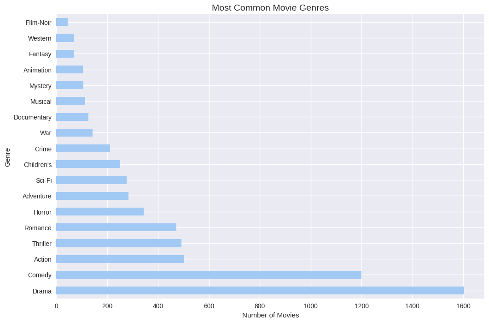

# 🎬 Movie Recommendation System

## 📂 Dataset
- **MovieLens 1M Dataset** from Kaggle: contains approximately **1,000,000 ratings** from around **6,000 users** on nearly **4,000 movies**.  
- Files included: `users.dat`, `ratings.dat`, `movies.dat`.  
- Link: [MovieLens 1M Dataset](https://www.kaggle.com/datasets/shikharg97/movielens-1m)
It contains:
- 6,000+ users
- 4,000+ movies
- 1,000,000 ratings

---

## 📌 Project Description
This project implements a **Movie Recommendation System** using the **MovieLens 1M dataset**.  
The system recommends movies to users based on **user similarity** and also includes additional approaches:

- Building a **User-Item Matrix**
- **User-based Collaborative Filtering**
- **Evaluation using Precision@K**
**Gradio Web App:** Upload a movie title and receive top recommendations instantly.
- **Bonus 1**: Item-based Collaborative Filtering
- **Bonus 2**: Matrix Factorization using **SVD**

---

## 🛠️ Tools & Libraries
- Python  
- Pandas  
- Numpy  
- Scikit-learn  

---

## 📊 Data Exploration — Most Common Movie Genres
During the preprocessing, genres were analyzed to see which are the most frequent in the dataset.  

*(The figure shows the top movie genres such as Drama, Comedy, Action, Thriller, etc.)*

---

## 🚀 Implementation Steps

### 1. Data Loading & Preprocessing
- Load data from `users.dat`, `ratings.dat`, `movies.dat` (separator `::`).
- Convert data types and handle missing values if necessary.
- Build a **User–Item Matrix** (rows = users, columns = movies, values = ratings).

### 2. User-based Collaborative Filtering
- Compute **user similarity** using methods like cosine similarity or Pearson correlation.
- For each target user, find the top-N similar users.
- Recommend unseen movies that were rated highly by these similar users.

### 3. Evaluation — Precision@K
- Split ratings into train and test sets.
- For each user in the test set:
  - Generate top-K recommendations.
  - Compute:
    \[
    Precision@K = \frac{\text{Relevant Recommendations in Top-K}}{K}
    \]
- Evaluate performance across different values of K (e.g., 5, 10, 20).

### 4. Bonus 1: Item-based Collaborative Filtering
- Compute **item–item similarity** using the User–Item Matrix.
- Recommend movies similar to those the user already liked.

### 5. Bonus 2: Matrix Factorization (SVD)
- Apply **Singular Value Decomposition (SVD)** to decompose the User–Item Matrix.
- Estimate ratings for unseen movies.
- Recommend top-rated unseen movies based on predicted values.

---

## 📊 Results & Evaluation
- **User-based CF** successfully recommends movies aligned with user preferences.
- **Item-based CF** improves recommendations by leveraging movie similarities.
- **SVD-based factorization** captures hidden features and enhances accuracy.
- Performance is measured using **Precision@K**.

---

## 🔮 Future Improvements

- Implement a Hybrid Recommender System (Collaborative + Content-based).

- Explore Deep Learning approaches (Autoencoders, Neural Collaborative Filtering).

- Deploy as a Web Application using Flask or Streamlit.

 ---
## 📂 Project Structure
---
Movie-Recommendation-System/
│
├── README.md
├── requirements.txt
├── movie_recommendation_system.ipynb
├── 📁 data/  
│   ├── users.dat
│   ├── ratings.dat
│   └── movies.dat
├── 📁 models/                      
│   └── movie_data.pkl

---
👩‍💻 Author

Developed by Basmala Ahmed Mohmaed 
 LinkedIn: www.linkedin.com/in/basmala-ahmed-mohamed-5a8377289

---
